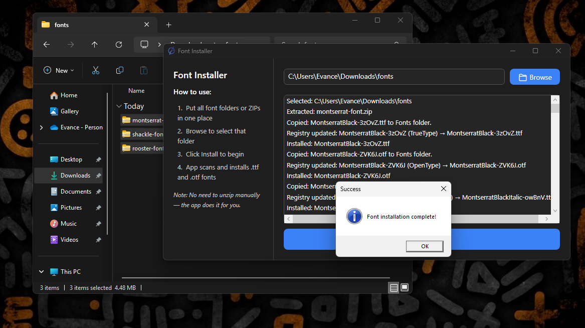

# FontInstallerApp

A modern, is an open-source WPF application for Windows that allows users (Graphic designer, Editors, etc.) to easily install fonts from ZIP archives. The app  supports `.ttf` and `.otf` fonts, and handles system font installation with administrator privileges.

## Features

- **Browse and select a folder** containing ZIP files with fonts.
- **Automatic extraction** of ZIP archives.
- **Installs TrueType (`.ttf`) and OpenType (`.otf`) fonts** to the Windows Fonts directory.
- **Registry update** for system-wide font registration.
- **Dark mode UI** with a custom dark title bar.
- **Detailed log output** for all actions and errors.
- **Admin rights detection** and guidance for system font installation.

## Screenshots

  
*Main window with dark theme and instructions sidebar.*

  
*Folder selection dialog for choosing font ZIPs.*

  
*Confirmation after successful font installation.*

## Requirements

- Windows 10 or later
- [.NET 8 Desktop Runtime](https://dotnet.microsoft.com/en-us/download/dotnet/8.0)
- Administrator privileges (for system-wide font installation)

## Installation

1. **Clone the repository:**git clone https://github.com/Evance262/FontInstallerApp.git
2. **Open the solution in Visual Studio 2022 or later.**

3. **Build the project.**

4. **Run the app as administrator:**
   - Click `FontInstallerApp.exe` in `bin\Debug\net8.0-windows` and select **Run as administrator**.

## Quick Start (Download & Run)

If you just want to use the app without building it yourself:

1. **Download the latest release ZIP** from the [Releases page](https://github.com/Evance262/FontInstallerApp/releases).
2. **Extract** the ZIP file to a folder of your choice.
3. **Right-click** `FontInstallerApp.exe` and select **Run as administrator** (required for system font installation).
4. Start using the app!

---

## Usage

1. **Browse** for a folder containing ZIP files with fonts.
2. The app **extracts** all ZIPs and scans for `.ttf` and `.otf` files.
3. **Review the log** for detected fonts.
4. Click **Install Fonts** to install all found fonts.
5. The app copies fonts to the system Fonts folder, updates the registry, and notifies Windows of the change.

> **Note:**  
> System-wide font installation requires administrator rights. If you do not run the app as admin, installation will fail.

## How It Works

- **Extraction:** Uses `System.IO.Compression.ZipFile` to extract ZIPs to a temp folder.
- **Font Copy:** Copies font files to `C:\Windows\Fonts`.
- **Registry Update:** Adds font entries to `HKLM\SOFTWARE\Microsoft\Windows NT\CurrentVersion\Fonts`.
- **Font Notification:** Calls `AddFontResourceEx` and broadcasts `WM_FONTCHANGE` to notify the system.
- **Dark Title Bar:** Uses `DwmSetWindowAttribute` for immersive dark mode.

## Customization

- **UI:** Modify `MainWindow.xaml` for layout and styles.
- **Font Handling:** Extend `InstallFont` in `MainWindow.xaml.cs` for more formats or custom logic.

## Troubleshooting

- **Access Denied:** Ensure you run the app as administrator.
- **Font Not Appearing:** Some apps may require restart to detect new fonts.
- **Build Errors:** Make sure no instance of the app is running during build.

## Contributing

Contributions are welcome! Please open issues or submit pull requests.

## License

This project is licensed under the [MIT License](LICENSE).

## Credits

- Built with WPF and .NET 8
- Dark mode title bar via [DwmSetWindowAttribute](https://learn.microsoft.com/en-us/windows/win32/api/dwmapi/nf-dwmapi-dwmsetwindowattribute)

---

*Happy font installing!*